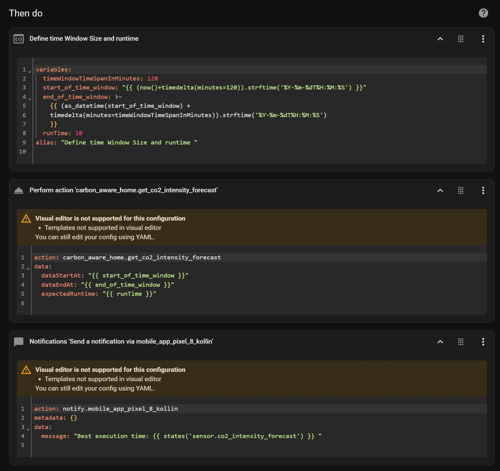
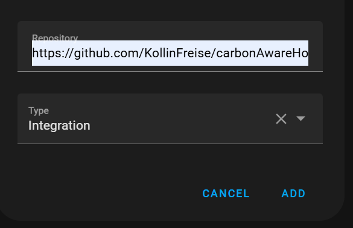

# Home Assistant Integration: Carbon Aware Home

## Disclaimer

Please be aware that we are developing this integration to the best of our knowledge and belief, but we cannot provide a guarantee. Therefore, use this integration at your own risk.

## Main Features

This integration helps shift energy-intensive tasks to times when the carbon intensity is as low as possible. It provides both current and forecast data.


**1. Current Energy Grid Data**

- **Input**: Current location
- **Output**: The actual energy grid value in gCO2eq/kWh

**2. Forecasted Energy Grid Data**

- **Input**: Current location, Time Window (Start Time, End Time), Expected Runtime
- **Output**: Best execution time, Forecasted energy grid value in gCO2eq/kWh

## Example Dashboard

**Text Presentation of Sensor Data:**


**Graph Presentation of Sensor Data:**


**Using Actions in Automation:**



## HASC Installation (1st option)

1. **Generate an API Key**

   ```shell
   curl -X POST "https://intensity.carbon-aware-computing.com/register" -H "accept: */*" -H "Content-Type: application/json" -d "{"your@email.de":"string"}"
   ```

   Register with the Carbon Aware Computing API. An API key will be sent to your email address. The address is only used to inform you about incompatible changes to this service.
2. **Install Integration**

   HASC: Go to HASC --> three point menu (...) --> Custom Repostitorys --> Add thes git repo

   

## Manual Installation (2nd option)

Copy all file from the [folder](https://github.com/KollinFreise/carbonAwareHome/tree/main/custom_components/carbonAwareHome) `custom_components/carbon_aware_home/carbonAwareHome` to `/custom_components/carbon_aware_home` in Home Assistant manually.

## Configuration

After installation you have to config your API Key.

**Add Credentials to `configuration.yaml`**

```yaml
carbon_aware_home:
  api_key: "yourAPIKey"
  location: de
```

<details>
  <summary>Location could be one of these values:</summary>

* de
* fr
* at
* ch
* be
* fi
* nl
* uk
* london
* southwales
* germanywestcentral
* switzerlandnorth
* francecentral
* uksouth
* ukwest
* eu-central-1
* eu-central-2
* eu-west-3
* europe-west3
* europe-west6
* europe-west9
* az
* ba
* by
* cy
* cz
* dk
* ee
* es
* ge
* gr
* hr
* hu
* ie
* lt
* lu
* lv
* md
* me
* mk
* mt
* nie
* no
* pl
* pt
* ro
* rs
* ru
* se
* sl
* sk
* tr
* ua
* xk
* northscotland
* southscotland
* northwestengland
* northeastengland
* yorkshire
* northwales
* westmidlands
* eastmidlands
* eastengland
* southwestengland
* southengland
* southeastengland
* england
* scotland
* wales

</details>

## Use Current CO2 Sensor Data

If the installation was successful, there should be a sensor you can use to get the current data.

`sensor.current_co2_intensity`

## Use CO2 Forecast

You can use the `get_co2_intensity_forecast` function to find the best execution time.
Try it out using Developer Tools -> Actions

```yaml
action: carbon_aware_home.get_co2_intensity_forecast
data:
  dataStartAt: ""
  dataEndAt: ""
  expectedRuntime: 10
```

The result will be stored in `sensor.co2_intensity_forecast`.

Possible values are "Error", "Timeout", "No Data", or a valid time.

## Use CO2 Forecasted delay service

You can use the `delay_execution_by_co2_forecast` function to find the best execution time and let an automation wait until this time to start an automation. 
Try it out using Developer Tools:

```yaml
action: carbon_aware_home.delay_execution_by_co2_forecast
data:
  dataStartAt: "{{ start_of_time_window }}"
  dataEndAt: "{{ end_of_time_window }}"
  expectedRuntime: "{{ runTime }}"
```
or use it in Automations.
<details>
   <summary>Automation description</summary>
   This automation, named "green_washer," is designed to optimize the operation of a device by minimizing carbon emissions during its runtime. When the device's switch is activated, the automation calculates an optimal time window between 8 AM and 9 PM for the device to operate. It assesses the current time and adjusts the start time accordingly, ensuring that if the current time is outside this window, the operation is postponed to the next suitable time. The automation also considers the current carbon intensity by accessing a sensor and delays the device's operation to a period within the specified window when carbon emissions are forecasted to be lower. Once the optimal time is determined, the device is turned on, and a notification is sent to a mobile app to inform the user that the device has started. This approach ensures that the device runs efficiently while reducing its environmental impact.
</details>

```yaml
alias: green_washer
description: ""
triggers:
  - type: turned_on
    device_id: xxxxx
    entity_id: xxxxx
    domain: switch
    trigger: device
conditions: []
actions:
  - variables:
      earlyest_time: 8
      latest_time: 21
      start_of_time_window: >-
          
          {{ (current_time + timedelta(days=1)).replace(hour=earlyest_time, minute=0, second=0, microsecond=0) }}
        
          {{ current_time.replace(hour=earlyest_time, minute=21, second=0, microsecond=0)}}
        
          {{ current_time }}
        
      end_of_time_window: >-
          {{
        start_time.replace(hour=21, minute=00, second=0, microsecond=0) }}
      runTime: 60
  - action: carbon_aware_home.delay_execution_by_co2_forecast
    data:
      dataStartAt: "{{ start_of_time_window }}"
      dataEndAt: "{{ end_of_time_window }}"
      expectedRuntime: "{{ runTime }}"
  - type: turn_on
    device_id: xxxxx
    entity_id: xxxxx
    domain: switch
  - data:
      message: started!
    action: notify.mobile_app_pixel
mode: restart
```yaml


The result will be stored in `sensor.co2_intensity_forecast`.

Possible values are "Error", "Timeout", "No Data", or a valid time.

## Data Source

This integration uses an API provided by [Carbon Aware Computing](https://www.carbon-aware-computing.com/).
The forecast and actual data for Europe (excluding the UK) are gathered from [Energy Charts](https://www.energy-charts.info/) provided by [Fraunhofer ISE](https://www.ise.fraunhofer.de/). It is licensed under [CC0](https://creativecommons.org/publicdomain/zero/1.0/), allowing you to use it for any purpose without any credits.

The forecast and actual data for the United Kingdom are gathered from [UK National Grid ESO](https://carbonintensity.org.uk/). It is licensed under [CC BY 4.0 DEED](https://creativecommons.org/licenses/by/4.0/). See the [terms of usage](https://github.com/carbon-intensity/terms/).
