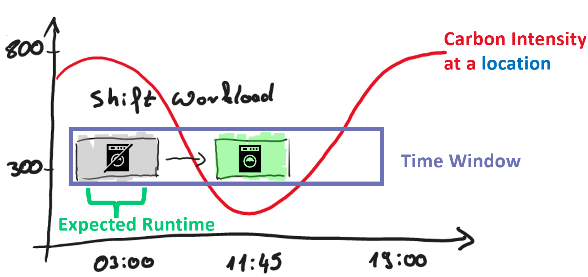
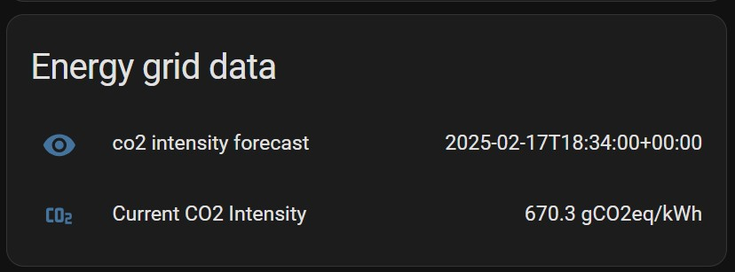
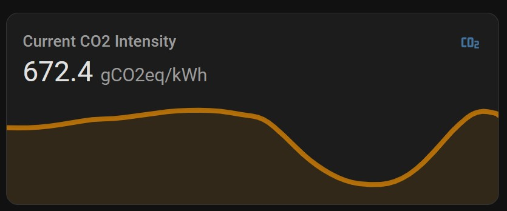
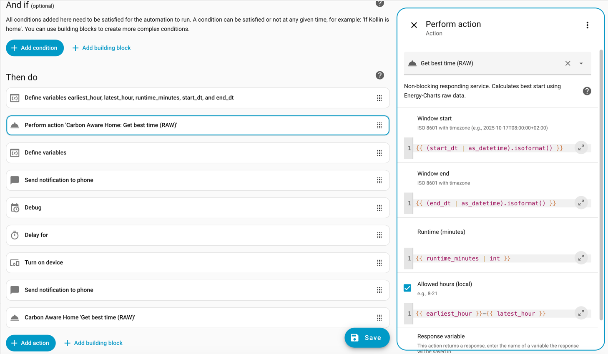
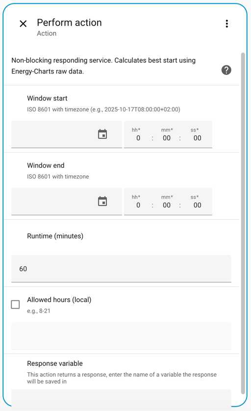
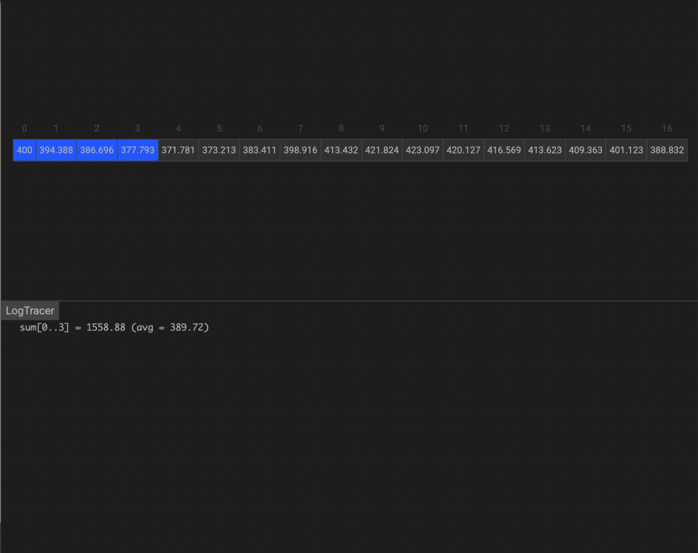

# Home Assistant Integration: Carbon Aware Home

## Disclaimer

Please note that we are developing this integration to the best of our knowledge and belief, but we cannot provide any guarantees. Use this integration at your own risk.

## Main Features

This integration helps shift energy-intensive tasks to times when the carbon intensity is as low as possible. It provides both current and forecast data.



**1. Current Energy Grid Data**

- **Input**: Current location
- **Output**: Actual energy grid value in gCO2eq/kWh

**2. Forecasted Energy Grid Data**

- **Input**: Current location, time window (start time, end time), expected runtime
- **Output**: Best execution time, forecasted energy grid value in gCO2eq/kWh

## Using the Sensor

**Text Presentation of Sensor Data:**



**Graphical Presentation of Sensor Data:**



## Using the Forecast

**Using Carbon Aware Forecast in Automations with Variables (edit in YAML):**



**Using Carbon Aware Forecast in Automations via the GUI:**


## HASC Installation (Option 1)

1. **Install Integration**

   HASC: Go to HASC --> three-dot menu (...) --> Custom Repositories --> Add this Git repository

   

## Manual Installation (Option 2)

Copy all files from the [folder](https://github.com/KollinFreise/carbonAwareHome/tree/main/custom_components/carbonAwareHome) `custom_components/carbon_aware_home/carbonAwareHome` manually to `/custom_components/carbon_aware_home` in Home Assistant.

## Configuration

After installation, you need to activate the integration by configuration.yaml.


Minimal Setup:
```yaml
carbon_aware_home:
  location: de
```

Full example:
```yaml
carbon_aware_home:
  location: de                 # Location code (see list below)
  refresh_interval_minutes: 30 # How often the CO2 data cache is refreshed
```

<details>
  <summary>Possible location values:</summary>

* de
* fr
* at
* ch
* be
* fi
* nl
* uk
* london
* southwales
* germanywestcentral
* switzerlandnorth
* francecentral
* uksouth
* ukwest
* eu-central-1
* eu-central-2
* eu-west-3
* europe-west3
* europe-west6
* europe-west9
* az
* ba
* by
* cy
* cz
* dk
* ee
* es
* ge
* gr
* hr
* hu
* ie
* lt
* lu
* lv
* md
* me
* mk
* mt
* nie
* no
* pl
* pt
* ro
* rs
* ru
* se
* sl
* sk
* tr
* ua
* xk
* northscotland
* southscotland
* northwestengland
* northeastengland
* yorkshire
* northwales
* westmidlands
* eastmidlands
* eastengland
* southwestengland
* southengland
* southeastengland
* england
* scotland
* wales

</details>

## Using Current CO2 Sensor Data

If the installation was successful, there should be a sensor available to get the current data.

`sensor.current_co2_intensity`

## Using the CO2 Forecast

You can use the `get_co2_intensity_forecast` function to find the best execution time.
Try it out using Developer Tools -> Actions.

## Services
### delay_execution_by_co2_forecast_raw

Purpose: Schedules a run to start at the lowest CO₂ intensity within a window.
Fields:
dataStartAt (required, datetime ISO 8601 with timezone): Window start.
dataEndAt (required, datetime ISO 8601 with timezone): Window end.
expectedRuntime (required, minutes, default 60, 1–1440): Duration to fit inside the window.
allowedHours (optional, text, e.g., "8-21"): Restrict starts to local hours.
targetService (optional, text): Service to call at the chosen time.
targetData (optional, text, JSON string): Payload for targetService.

### get_co2_intensity_forecast_raw
Purpose: Computes the best time from raw data and updates sensor.co2_intensity_forecast.
Fields:
dataStartAt (required, datetime)
dataEndAt (required, datetime)
expectedRuntime (required, minutes, default 60, 1–1440)
allowedHours (optional, text)

### get_best_time_raw
Purpose: Non-blocking response; returns the best start time using Energy-Charts raw data.
Fields:
dataStartAt (required, datetime ISO 8601 with timezone)
dataEndAt (required, datetime)
expectedRuntime (required, minutes, default 60, 1–1440)
allowedHours (optional, text)

The result will be stored in `sensor.co2_intensity_forecast`.

Possible values are "Error", "Timeout", "No Data", or a valid time.

## How does the service work?

### Raw Data Source
The raw data is collected by Energycharts from Fraunhofer (https://api.energy-charts.info/co2eq).
It provides the CO2 intensity in 15-minute intervals.
For example:

|     #    |      unix_sec     |     gCO2/kWh    |
|:--------:|:-----------------:|:---------------:|
|     1    |     1760680800    |      400.000    |
|     2    |     1760681700    |      394.388    |
|     3    |     1760682600    |      386.696    |
|     4    |     1760683500    |      377.793    |
|     5    |     1760684400    |      371.781    |
The data is cached in Home Assistant according to the refresh interval defined in configuration.yaml (default: 30 min).
This reduces the number of API calls and helps to get faster response times. How often Energy Charts refreshes its data depends on the energy grid provider and is not documented.

### Calculate the Best Time to Start
With all the CO2/kWh values in 15-minute intervals, we use a sliding window algorithm to calculate the best start time.
When a carbon-aware task is predicted to need 1 hour, we use the sliding window algorithm with a window zize of 4 (4 x 15 min = 60 min).

After calculating the mean value for each time window, we can determine the best start time with the lowest mean value of CO2/kWh.

### Sensor Data Values
Using the original API data, the sensor would provide new sensor data every 15 minutes.
To improve the user experience, we extrapolate the data to provide an update frequency of 1 minute.
