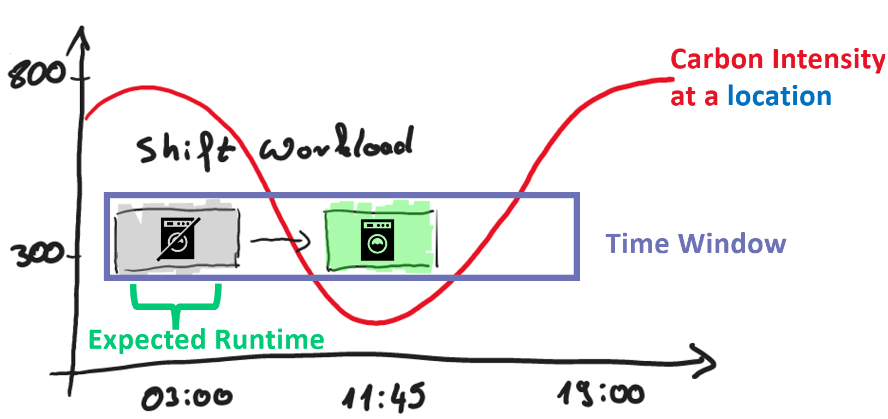
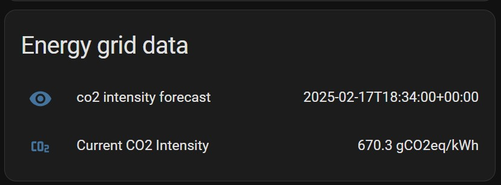
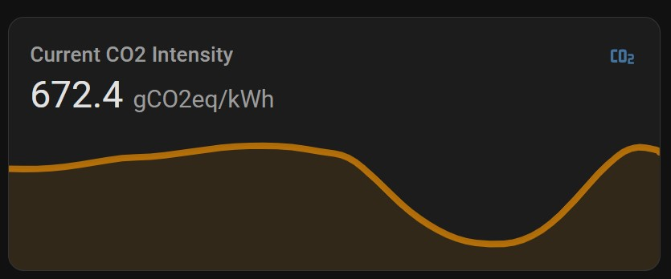

# Home Assistant Integration: Carbon Aware Home

## Disclaimer

Please be aware that we are developing this integration to the best of our knowledge and belief, but we cannot provide a guarantee. Therefore, use this integration at your own risk.

## Main Features

This integration helps shift energy-intensive tasks to times when the carbon intensity is as low as possible. It provides both current and forecast data.



**1. Current Energy Grid Data**

- **Input**: Current location
- **Output**: The actual energy grid value in gCO2eq/kWh

**2. Forecasted Energy Grid Data**

- **Input**: Current location, Time Window (Start Time, End Time), Expected Runtime
- **Output**: Best execution time, Forecasted energy grid value in gCO2eq/kWh

## Example Dashboard

**Text Presentation of Sensor Data:**

 

**Graph Presentation of Sensor Data:**

 

**Using Actions in Automation:**

 

## Installation

1. **Generate an API Key**

   ```shell
   curl -X POST "https://intensity.carbon-aware-computing.com/register" -H "accept: */*" -H "Content-Type: application/json" -d "{"your@email.de":"string"}"
   ```

   Register with the Carbon Aware Computing API. An API key will be sent to your email address. The address is only used to inform you about incompatible changes to this service.
2. **Install Integration**

   HASC: Go to HASC -->

   
4. **Add Credentials to `config.yaml`**

   ```yaml
   carbon_aware_home:
     api_key: "yourAPIKey"
     location: de
   ```

## Use Current CO2 Sensor Data

If the installation was successful, there should be a sensor you can use to get the current data.

`sensor.current_co2_intensity`

## Use CO2 Forecast

You can use the `get_co2_intensity_forecast` function to find the best execution time.
Try it out using Developer Tools -> Actions

```yaml
action: carbon_aware_home.get_co2_intensity_forecast
data:
  dataStartAt: ""
  dataEndAt: ""
  expectedRuntime: 10
```

The result will be stored in `sensor.co2_intensity_forecast`.

Possible values are "Error", "Timeout", "No Data", or a valid time.

## Data Source

This integration uses an API provided by [Carbon Aware Computing](https://www.carbon-aware-computing.com/).
The forecast and actual data for Europe (excluding the UK) are gathered from [Energy Charts](https://www.energy-charts.info/) provided by [Fraunhofer ISE](https://www.ise.fraunhofer.de/). It is licensed under [CC0](https://creativecommons.org/publicdomain/zero/1.0/), allowing you to use it for any purpose without any credits.

The forecast and actual data for the United Kingdom are gathered from [UK National Grid ESO](https://carbonintensity.org.uk/). It is licensed under [CC BY 4.0 DEED](https://creativecommons.org/licenses/by/4.0/). See the [terms of usage](https://github.com/carbon-intensity/terms/).
